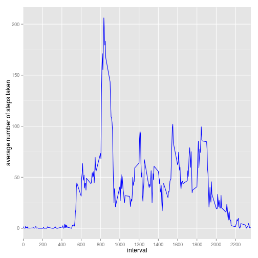

# Reproducible Research: Peer Assessment 1


## Loading and preprocessing the data

```r
library(data.table)
data <- read.table(unz("activity.zip","activity.csv"),header=TRUE, sep=",")
dt <- data.table(data)
r <- dt[, list(stepsum=sum(steps, na.rm=TRUE)), by=date]
```
## Histogram of the total number of steps taken each day

```r
library(ggplot2)
ggp1 <- ggplot(r, aes(stepsum)) + geom_histogram(binwidth=3000, color="black", fill="white") + xlab("total number of steps taken each day")
print(ggp1)
```

 
## Mean and median number of steps taken each day 

```r
mean(r$stepsum, na.rm=TRUE)
```

```
## [1] 9354
```

```r
median(r$stepsum, na.rm=TRUE)
```

```
## [1] 10395
```

##  Time series plot of the average number of steps taken (averaged across all days) versus the 5-minute intervals

```r
avgNumOfSteps <- dt[, list(stepsTaken = mean(steps, na.rm=TRUE)), by=interval]
ggp2 <- ggplot(avgNumOfSteps, aes(interval, stepsTaken)) + geom_line(colour="blue") + scale_x_discrete(breaks=seq(0, max(avgNumOfSteps$interval),by=200))  + ylab("average number of steps taken")
print(ggp2)
```

 
## 5-minute interval that, on average, contains the maximum number of steps

```r
avgNumOfSteps[avgNumOfSteps$stepsTaken == max(avgNumOfSteps$stepsTaken), interval]
```

```
## [1] 835
```
## Imputing missing values

### total number of missing values in the dataset (i.e. the total number of rows with NAs)

```r
z <-is.na(data$steps)
length(z[z==TRUE])
```

```
## [1] 2304
```
### create a new dataset that is equal to the original dataset but with the missing data filled in.
Copy data to new dataset('mdt')
If there is NA in data frame, substitute in with previously calculated average number of steps for corresponding interval

```r
mdt <- dt
mdt$steps <-  ifelse(is.na(mdt$steps), avgNumOfSteps[avgNumOfSteps$interval== mdt$interval, avgNumOfSteps$stepsTaken], mdt$steps)
stepsTaken <- mdt[, list(stepsum=sum(steps)), by=date]
```
### histogram of the total number of steps taken each day after missing values were imputed

```r
ggp3 <- ggplot(stepsTaken, aes(stepsum)) + geom_histogram(binwidth=3000, color="black", fill="white") + xlab("total number of steps taken each day")
print(ggp3)
```

 
### Mean and median number of steps taken each day after missing values were imputed

```r
mean(stepsTaken$stepsum)
```

```
## [1] 10766
```

```r
median(stepsTaken$stepsum)
```

```
## [1] 10766
```
### impact of imputing missing data on the estimates of the total daily number of steps

Before imputting missing data we had many days with little number of steps, most of them were full of NAs.
With data instead of NAs, we have more steps to sum up, and we have less days with little number of steps.
Mean, median - shifted right

## Average daily activity pattern
### Panel plot comparing the average number of steps taken per 5-minute interval across weekdays and weekends

```r
#create factor variable in the dataset with two levels – “weekday” and “weekend” 
wdays <- function(x){
        wds <- weekdays(as.Date(x, "%Y-%m-%d"))
        result <- ifelse (wds == "Sunday" | wds == "Saturday", "1" , "2")
        return(result)
}
mdt$wday <- wdays(levels(mdt$date)[as.numeric(mdt$date)])
mdt$wday <-factor(mdt$wday, labels=c("weekend", "weekday"))

#prepare data for plotting
tmp2 <- aggregate(x = mdt$steps, by=list(mdt$interval, mdt$wday), FUN=mean)
maxx <-max(tmp2$Group.1)
tmp2$Group.1 <- factor(tmp2$Group.1)
ggp <- ggplot(tmp2, aes(x= Group.1, y=x)) + facet_grid(Group.2 ~.) + geom_line(aes(group=Group.2), colour="blue") + scale_x_discrete(breaks=seq(0, maxx,by=200)) + ylab("average number of steps taken") + xlab("interval")
print(ggp)
```

 

### What is the average daily activity pattern?

From 0 to  6:00 there is no activity – possibly sleep time or other activities that do not require walking or incompatible with wearing monitoring device
From 6:00 to 10:00 a lot of acivities – possibly  breakfast time and commute to work, or to other place to spend time. 
Then lesser activity throughout the day , except peaks at lunchtime,  at 16:00, and at 19:00- perhaps commute to home
 
### Are there differences in activity patterns between weekdays and weekends?
Weekday starts 2 hours earlier, weekend finishes 1 hour later.
Less activity throughout working time in weekdays – perhaps sedentary job.
